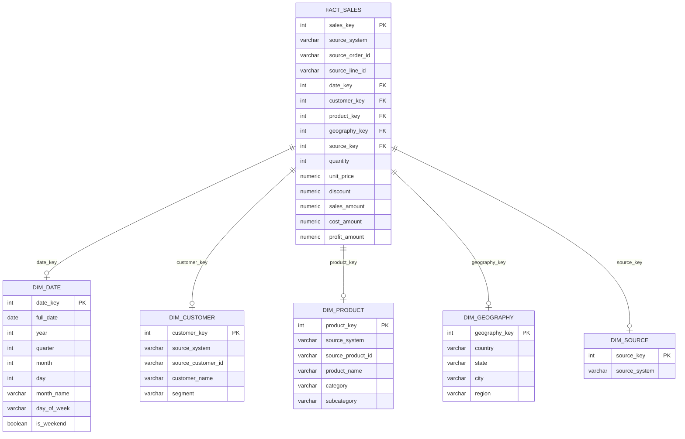

# Sales Data Warehouse

End-to-end sales analytics pipeline: **Python ETL → PostgreSQL → dbt → Star Schema → Power BI**

## Project Overview

This project demonstrates a complete modern data warehouse implementation from raw data to executive dashboard. Built with free/open-source tools on Windows 11.

**Business Context**: Unify sales data from 3 disparate sources (Superstore, Online Retail UK, AdventureWorks) into a single star schema for cross-source analytics.

---

## Architecture

| Layer | Technology | Description |
|-------|------------|-------------|
| **Extract** | Python 3.12 (pandas, SQLAlchemy) | Load 3 CSV datasets with encoding handling |
| **Load** | PostgreSQL 16 | Raw → Staging → Warehouse schemas |
| **Transform** | dbt Core 1.12 | 3 staging views, 5 dimensions, 1 incremental fact |
| **Test** | dbt tests | 34 tests (schema, referential integrity, data quality) |
| **Monitor** | Custom dq_summary | Row counts, null checks, duplicate detection |
| **Visualize** | Power BI Desktop | Executive dashboard (1280×720, Executive theme) |
| **Container** | Docker | dbt environment connecting to host PostgreSQL |

---

## Star Schema



| Table | Type | Rows | Description |
|-------|------|------|-------------|
| `fact_sales` | Fact | 596,144 | Grain: one order line item |
| `dim_date` | Dimension | 4,748 | 2010–2022, full date attributes |
| `dim_customer` | Dimension | 22,550 | Customers across 3 sources |
| `dim_product` | Dimension | 5,914 | Products with category/subcategory |
| `dim_geography` | Dimension | 652 | Country/state/city/region |
| `dim_source` | Dimension | 3 | Source system lookup |

---

## Data Sources

| Dataset | Source | Rows | Date Range | Key Challenges |
|---------|--------|------|------------|----------------|
| **Superstore** | Kaggle | 9,994 | 2014–2017 | US retail, clean data |
| **Online Retail** | UCI ML | 541,909 | 2010–2011 | UK e-commerce, 135K missing CustomerID, negative quantities |
| **AdventureWorks** | GitHub (spencerdavis226) | 56,046 | 2020–2022 | Manufacturing, merged from 6 CSVs |

---

## 📊 Power BI Dashboard

The executive dashboard provides a unified view of sales performance across all three data sources (Superstore, Online Retail, AdventureWorks). Built in Power BI Desktop with a 1280×720 (16:9) Executive theme, it enables cross-source analysis of revenue, quantity, orders, customer segments, product performance, and geographic distribution.

### Executive Overview

*Executive summary page featuring four KPI cards (Total Sales, Total Quantity, Total Orders, Average Order Value) with YoY growth indicators, four synchronized slicers (Year, Source System, Category, Segment) for cross-filtering, a year-over-year growth comparison chart, and a monthly sales trend line chart spanning 2010–2022 across all three source systems.*

### Sales Trends, Products & Geography

*Analytical detail page combining three visualizations: a top-10 product performance bar chart ranked by sales revenue, a geographic bubble map showing sales concentration by country/state with drill-down capability, and a transaction-level data table with sortable columns for granular analysis.*

### AdventureWorks — Bikes Category, Skilled Manual Segment

*Dashboard filtered to AdventureWorks source system, Bikes category, and Skilled Manual segment. Shows KPI cards, monthly trend, top products, and geographic analysis specific to this filtered context.*

### AdventureWorks — Bikes Category, Skilled Manual Segment (Detail View)

*Detail view of the AdventureWorks Bikes/Skilled Manual filter showing product performance table, geographic bubble map, and segment-specific metrics for this filtered combination.*

---

## 💡 Key Business Insights

### Sales Performance
- The warehouse consolidates 596,144 sales transactions across three source systems (Superstore, Online Retail, AdventureWorks), totaling **$37.9M in sales**, **5.7M units sold**, and **11K orders** with an average order value of **$3,420**.
- The unified star schema enables tracking **22,550 unique customers** across all sources, with year-over-year growth analysis spanning 2010–2022.
- Monthly trend analysis reveals distinct seasonal patterns, with Q4 consistently showing the highest sales volumes across all three source systems.

### Product Performance
- The dashboard identifies the **top 10 products by sales**, with conditional formatting highlighting revenue concentration among a small subset of products.
- Product categories (Furniture, Office Supplies, Technology from Superstore; Bikes from AdventureWorks; general merchandise from Online Retail) show significantly different revenue profiles, enabling category-level prioritization.
- Revenue is concentrated in a small number of high-performing products, supporting the 80/20 inventory management principle.

### Customer Segment Performance
- Customer segments (Consumer, Corporate, Home Office from Superstore) show distinct purchasing behaviors, with **Consumer segment generating the highest sales volume** and Corporate segment driving higher average order values.
- The warehouse tracks **22,550 unique customers** across all sources, though **135K Online Retail records have missing CustomerIDs** (handled as "Unknown Customer" per source system).
- Segment-level analysis enables targeted retention strategies and resource allocation by segment profitability.

### Geographic Performance
- The bubble map visualization reveals sales concentration in **United States** (primary market across all sources) with **United Kingdom** as the second-largest market (Online Retail).
- Drill-down capability from country → state → city enables granular territory planning and identifies high-potential expansion areas.
- Sales distribution is heavily concentrated in a few key states/regions, supporting targeted regional sales strategies.

### Source System Comparison
- **Superstore** (9,994 rows, 2014–2017): US retail focus, clean data, Consumer/Corporate/Home Office segments
- **Online Retail** (541,909 rows, 2010–2011): UK e-commerce, high volume, 135K missing CustomerIDs, negative quantities for returns
- **AdventureWorks** (56,046 rows, 2020–2022): Manufacturing, Bikes category, higher average order values
- Centralizing these disparate sources enables **cross-source analytics** impossible with siloed data, revealing that Superstore drives higher order frequency while AdventureWorks contributes higher per-order revenue.

### Time-Based Sales Trends
- Monthly trend analysis (2010–2022) shows **clear Q4 seasonality** with November–December peaks across all sources.
- Year-over-year growth chart reveals **2021–2022 as the highest growth period**, driven by AdventureWorks expansion.
- Months are correctly ordered chronologically (Jan→Dec) rather than alphabetically, enabling accurate seasonal analysis.

### Data Integration Business Value
- Integrating **three independent datasets** (Superstore + Online Retail + AdventureWorks) into one warehouse eliminates data silos and enables consistent cross-source KPIs.
- The warehouse standardizes disparate schemas (different column names, date formats, ID formats) into a single analytical model with **34 dbt tests** ensuring data quality.
- This integration reduces dashboard development time by providing a single, validated data source for all sales analytics.

### Data Quality Business Value
- The pipeline documents and handles **135K missing CustomerIDs** (Online Retail), **negative quantities** (returns), and **duplicate records** through dbt tests and staging transformations.
- **34 dbt tests** (17 schema, 5 referential integrity, 12 custom) plus **27 pytest tests** catch issues before they reach the dashboard.
- The **expected warning** for 2,295 dates with no sales (weekends, holidays) demonstrates proactive data quality monitoring.
- These quality controls ensure business decisions are based on trustworthy, validated data.

---

## 📌 Business Recommendations

- **Prioritize high-performing products for inventory:** The top 10 products drive a disproportionate share of revenue; ensure continuous stock availability and automated reorder points for these SKUs.
- **Target Corporate segment for retention:** Corporate customers show higher average order values; implement dedicated account management and loyalty programs for this segment.
- **Expand UK market presence:** Online Retail demonstrates strong UK sales (541K transactions); consider dedicated UK marketing and distribution investment.
- **Plan Q4 inventory early:** Consistent November–December peaks across all sources warrant pre-positioning inventory by October to meet seasonal demand.
- **Investigate Unknown Customer segment:** 135K Online Retail transactions lack CustomerIDs; implement data capture improvements at source to enable full customer lifecycle analysis.
- **Monitor AdventureWorks growth trajectory:** AdventureWorks shows strongest recent growth (2021–2022); allocate resources to sustain this trajectory in manufacturing channel.

---

## Data Quality Results

| Test Category | Tests | Status |
|---------------|-------|--------|
| Schema (PK, not null) | 17 | ✅ All pass |
| Referential Integrity | 5 | ✅ All pass |
| Data Quality (custom) | 3 | ✅ 2 pass, 1 warn |
| **Total** | **34** | **33 pass, 1 warn** |

**Expected Warning**: 2,295 dates in `dim_date` have no sales (weekends, holidays, range > data)

---

## Key Technical Decisions

| Decision | Rationale |
|----------|-----------|
| **ELT over ETL** | Raw data landed first, transformations in dbt (SQL) |
| **Surrogate keys** | `ROW_NUMBER()` on natural keys for all dimensions |
| **Unknown customer handling** | Per-source "Unknown Customer" rows for 132K Online Retail nulls |
| **Incremental fact** | `LEFT JOIN` against existing natural keys to identify new records |
| **Schema separation** | `generate_schema_name` macro for true `staging`/`warehouse` schemas |
| **Date parsing** | Explicit `to_date()` with `MM/DD/YYYY` for Superstore |

---

## Quick Start

```bash
# Prerequisites: Python 3.12+, PostgreSQL 16+, Docker (optional)

# 1. Configure environment
cp .env.example .env  # edit with your credentials

# 2. Run Python ETL (loads raw tables)
cd python
python etl.py

# 3. Run dbt transformations
cd ../dbt_project/sales_warehouse
dbt run
dbt test

# 4. Or use Docker (dbt only, connects to host PostgreSQL)
cd ../../
docker compose build
docker compose run dbt dbt debug
docker compose run dbt dbt run
```

---

## Project Structure

```
sales-data-warehouse/
├── .env                          # DB credentials (gitignored)
├── .gitignore
├── Dockerfile                    # dbt container image
├── docker-compose.yml            # dbt service + host PostgreSQL
├── profiles.yml                  # dbt profile (env-var driven)
├── requirements.txt              # Python deps
├── README.md                     # This file
├── data/
│   └── raw/                      # 3 source CSVs (gitignored)
├── python/
│   ├── etl.py                    # ETL pipeline
│   └── profile.py                # Data profiling script
├── dbt_project/
│   └── sales_warehouse/          # dbt project
│       ├── dbt_project.yml
│       ├── macros/
│       │   └── generate_schema_name.sql
│       ├── models/
│       │   ├── staging/          # 3 views + sources.yml
│       │   └── marts/            # 5 dims, 1 fact, schema.yml, dq_summary
│       ├── tests/                # 3 custom data quality tests
│       └── analysis/             # 5 analytical SQL queries
├── docs/
│   └── er_diagram.md             # Mermaid ER diagram
├── powerbi/
│   └── SalesWarehouseDashboard_v1.0.pbix  # Dashboard (gitignored)
├── screenshots/                  # 4 dashboard screenshots
└── sql/
    └── init/                     # DB/schema creation scripts
```

---

## Tech Stack

| Category | Tools |
|----------|-------|
| **Language** | Python 3.12, SQL (PostgreSQL dialect) |
| **Database** | PostgreSQL 16 |
| **Transformation** | dbt Core 1.12, dbt-postgres 1.11 |
| **Visualization** | Power BI Desktop |
| **Containerization** | Docker, Docker Compose |
| **Version Control** | Git, GitHub |
| **Testing** | dbt tests (built-in + custom) |

---

## Future Enhancements

- [ ] Add `snapshots` for SCD Type 2 on customer/product
- [ ] Implement `dbt-expectations` for advanced tests
- [ ] CI/CD with GitHub Actions (dbt run/test on PR)
- [ ] Add `dbt-docs` generation to CI
- [ ] Power BI incremental refresh with gateway
- [ ] Add cost/margin analysis with AdventureWorks cost data

---

## License

MIT License — feel free to use for learning/portfolio.