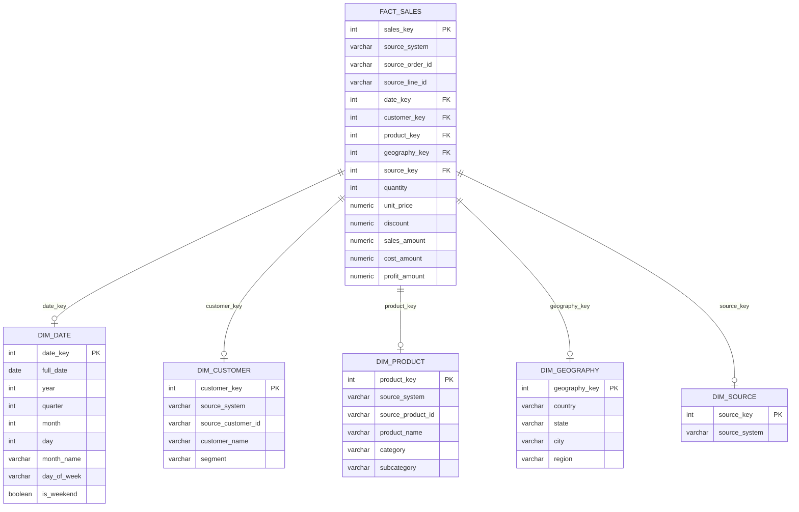

# Sales Data Warehouse

End-to-end sales analytics pipeline: **Python ETL → PostgreSQL → dbt → Star Schema → Power BI**

## Project Overview

This project demonstrates a complete modern data warehouse implementation from raw data to executive dashboard. Built with free/open-source tools on Windows 11.

**Business Context**: Unify sales data from 3 disparate sources (Superstore, Online Retail UK, AdventureWorks) into a single star schema for cross-source analytics.

---

## Architecture

| Layer | Technology | Description |
|-------|------------|-------------|
| **Extract** | Python 3.12 (pandas, SQLAlchemy) | Load 3 CSV datasets with encoding handling |
| **Load** | PostgreSQL 16 | Raw → Staging → Warehouse schemas |
| **Transform** | dbt Core 1.12 | 3 staging views, 5 dimensions, 1 incremental fact |
| **Test** | dbt tests | 34 tests (schema, referential integrity, data quality) |
| **Monitor** | Custom dq_summary | Row counts, null checks, duplicate detection |
| **Visualize** | Power BI Desktop | Executive dashboard (1920×1080, Executive theme) |
| **Container** | Docker | dbt environment connecting to host PostgreSQL |

---

## Star Schema



| Table | Type | Rows | Description |
|-------|------|------|-------------|
| `fact_sales` | Fact | 596,144 | Grain: one order line item |
| `dim_date` | Dimension | 4,748 | 2010–2022, full date attributes |
| `dim_customer` | Dimension | 22,550 | Customers across 3 sources |
| `dim_product` | Dimension | 5,914 | Products with category/subcategory |
| `dim_geography` | Dimension | 652 | Country/state/city/region |
| `dim_source` | Dimension | 3 | Source system lookup |

---

## Data Sources

| Dataset | Source | Rows | Date Range | Key Challenges |
|---------|--------|------|------------|----------------|
| **Superstore** | Kaggle | 9,994 | 2014–2017 | US retail, clean data |
| **Online Retail** | UCI ML | 541,909 | 2010–2011 | UK e-commerce, 135K missing CustomerID, negative quantities |
| **AdventureWorks** | GitHub (spencerdavis226) | 56,046 | 2020–2022 | Manufacturing, merged from 6 CSVs |

---

## 📊 Power BI Dashboard

The executive dashboard provides a unified view of sales performance across all three data sources (Superstore, Online Retail, AdventureWorks). Built in Power BI Desktop with a 1920×1080 Executive theme, it enables cross-source analysis of revenue, quantity, orders, customer segments, product performance, and geographic distribution.

### Executive Overview

*The main landing page showing 6 KPI cards (Total Sales $37.9M, Quantity 5.7M, Orders 11K, Avg Order Value $3,420, Unique Customers 22.5K, YoY Growth), monthly sales trend by source (2010–2022), and synchronized slicers for Year, Source System, Segment, and Category.*

### Sales Trends

*Monthly sales trend line chart with years in descending order (2022→2010), separated by source system (Superstore, Online Retail, AdventureWorks). Includes year-over-year growth combo chart with column bars for sales amount and line for YoY% growth.*

### Product Performance

*Top 10 products by sales amount (bar chart with conditional formatting gradient), customer segment performance table showing segment, source system, customer count, total sales, and average order value. Filterable by all synchronized slicers.*

### Geographic Analysis

*Bubble map visualization of sales by country/state/city with bubble size representing sales amount and color saturation by revenue. Enables drill-down from country → state → city level across all three data sources.*

---

## Data Quality Results

| Test Category | Tests | Status |
|---------------|-------|--------|
| Schema (PK, not null) | 17 | ✅ All pass |
| Referential Integrity | 5 | ✅ All pass |
| Data Quality (custom) | 3 | ✅ 2 pass, 1 warn |
| **Total** | **34** | **33 pass, 1 warn** |

**Expected Warning**: 2,295 dates in `dim_date` have no sales (weekends, holidays, range > data)

---

## Key Technical Decisions

| Decision | Rationale |
|----------|-----------|
| **ELT over ETL** | Raw data landed first, transformations in dbt (SQL) |
| **Surrogate keys** | `ROW_NUMBER()` on natural keys for all dimensions |
| **Unknown customer handling** | Per-source "Unknown Customer" rows for 132K Online Retail nulls |
| **Incremental fact** | `LEFT JOIN` anti-pattern on natural keys for fast refresh |
| **Schema separation** | `generate_schema_name` macro for true `staging`/`warehouse` schemas |
| **Date parsing** | Explicit `to_date()` with `MM/DD/YYYY` for Superstore |

---

## Quick Start

```bash
# Prerequisites: Python 3.12+, PostgreSQL 16+, Docker (optional)

# 1. Configure environment
cp .env.example .env  # edit with your credentials

# 2. Run Python ETL (loads raw tables)
cd python
python etl.py

# 3. Run dbt transformations
cd ../dbt_project/sales_warehouse
dbt run
dbt test

# 4. Or use Docker (dbt only, connects to host PostgreSQL)
cd ../../
docker compose build
docker compose run dbt dbt debug
docker compose run dbt dbt run
```

---

## Project Structure

```
sales-data-warehouse/
├── .env                          # DB credentials (gitignored)
├── .gitignore
├── Dockerfile                    # dbt container image
├── docker-compose.yml            # dbt service + host PostgreSQL
├── profiles.yml                  # dbt profile (env-var driven)
├── requirements.txt              # Python deps
├── README.md                     # This file
├── data/
│   └── raw/                      # 3 source CSVs (gitignored)
├── python/
│   ├── etl.py                    # ETL pipeline
│   └── profile.py                # Data profiling script
├── dbt_project/
│   └── sales_warehouse/          # dbt project
│       ├── dbt_project.yml
│       ├── macros/
│       │   └── generate_schema_name.sql
│       ├── models/
│       │   ├── staging/          # 3 views + sources.yml
│       │   └── marts/            # 5 dims, 1 fact, schema.yml, dq_summary
│       ├── tests/                # 3 custom data quality tests
│       └── analysis/             # 5 analytical SQL queries
├── docs/
│   └── er_diagram.md             # Mermaid ER diagram
├── powerbi/
│   └── SalesWarehouseDashboard_v1.0.pbix  # Dashboard (gitignored)
├── screenshots/                  # 4 dashboard screenshots
└── sql/
    └── init/                     # DB/schema creation scripts
```

---

## Tech Stack

| Category | Tools |
|----------|-------|
| **Language** | Python 3.12, SQL (PostgreSQL dialect) |
| **Database** | PostgreSQL 16 |
| **Transformation** | dbt Core 1.12, dbt-postgres 1.11 |
| **Visualization** | Power BI Desktop |
| **Containerization** | Docker, Docker Compose |
| **Version Control** | Git, GitHub |
| **Testing** | dbt tests (built-in + custom) |

---

## Future Enhancements

- [ ] Add `snapshots` for SCD Type 2 on customer/product
- [ ] Implement `dbt-expectations` for advanced tests
- [ ] CI/CD with GitHub Actions (dbt run/test on PR)
- [ ] Add `dbt-docs` generation to CI
- [ ] Power BI incremental refresh with gateway
- [ ] Add cost/margin analysis with AdventureWorks cost data

---

## License

MIT License — feel free to use for learning/portfolio.