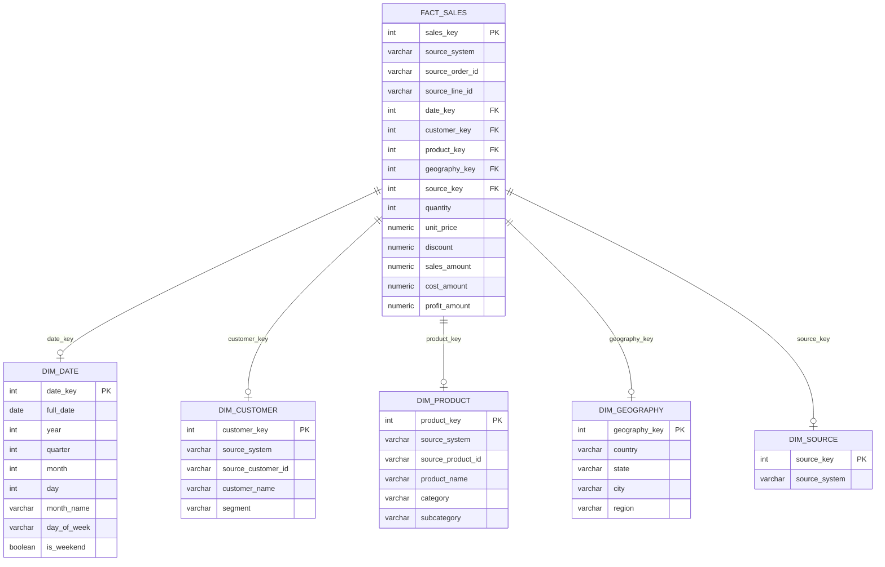

# Star Schema ER Diagram

```mermaid
erDiagram
    FACT_SALES ||--o| DIM_DATE : "date_key"
    FACT_SALES ||--o| DIM_CUSTOMER : "customer_key"
    FACT_SALES ||--o| DIM_PRODUCT : "product_key"
    FACT_SALES ||--o| DIM_GEOGRAPHY : "geography_key"
    FACT_SALES ||--o| DIM_SOURCE : "source_key"

    FACT_SALES {
        int sales_key PK
        varchar source_system
        varchar source_order_id
        varchar source_line_id
        int date_key FK
        int customer_key FK
        int product_key FK
        int geography_key FK
        int source_key FK
        int quantity
        numeric unit_price
        numeric discount
        numeric sales_amount
        numeric cost_amount
        numeric profit_amount
    }

    DIM_DATE {
        int date_key PK
        date full_date
        int year
        int quarter
        int month
        int day
        varchar month_name
        varchar day_of_week
        boolean is_weekend
    }

    DIM_SOURCE {
        int source_key PK
        varchar source_system
    }

    DIM_CUSTOMER {
        int customer_key PK
        varchar source_system
        varchar source_customer_id
        varchar customer_name
        varchar segment
    }

    DIM_PRODUCT {
        int product_key PK
        varchar source_system
        varchar source_product_id
        varchar product_name
        varchar category
        varchar subcategory
    }

    DIM_GEOGRAPHY {
        int geography_key PK
        varchar country
        varchar state
        varchar city
        varchar region
    }
```